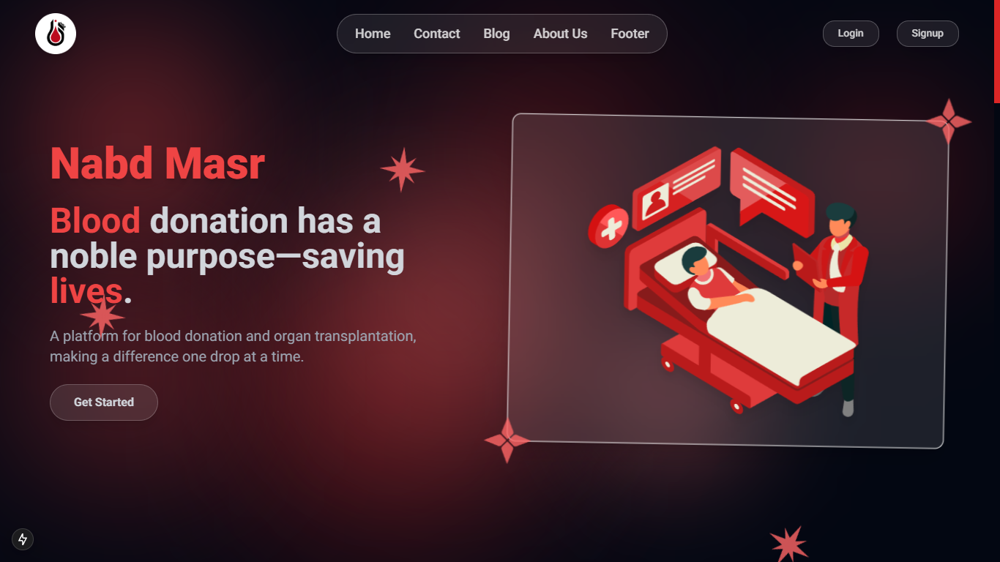

# NabdMasr - Blood Bank Website

## Overview

NabdMasr is a modern and user-friendly blood bank website designed to streamline blood donation and requests. Built using cutting-edge web technologies, the platform ensures accessibility, efficiency, and ease of use for donors, recipients, and administrators.

## Features

- **User Registration & Authentication**: Secure authentication system for donors and requesters.
- **Blood Donation Requests**: Users can request blood based on type and location.
- **Donor Database**: A well-structured database of donors categorized by blood type and location.
- **Real-Time Availability**: Live updates on blood stock availability.
- **Notifications & Alerts**: Email and SMS notifications for urgent blood requests.
- **Dark & Light Mode Support**: Aesthetic and user-friendly interface with theme toggling.
- **Mobile Responsive Design**: Fully optimized for all screen sizes.

## Tech Stack

NabdMasr leverages a powerful tech stack to deliver a seamless experience:

- **Next.js**: For fast and scalable server-side rendering.
- **Tailwind CSS**: For highly customizable styling.
- **Shadcn/UI**: To enhance UI/UX with pre-built components.
- **ReactBits**: For efficient state management and reusable UI patterns.
- **Tailwind UI**: To accelerate design with high-quality UI components.
- **MySQL**: For managing donor and request data.
- **PHP (Backend API)**: To handle requests, authentication, and database interactions.

## Installation

To set up NabdMasr locally, follow these steps:

```sh
# Clone the repository
git clone https://github.com/yourusername/nabdmasr.git
cd nabdmasr

# Install dependencies
npm install

# Run the development server
npm run dev
```

Open [http://localhost:3000](http://localhost:3000) in your browser to view the project.

## File Structure

```
/nabdmasr
│── app/
│   ├── layout.js      # Global layout
│   ├── page.js        # Main page component
│── components/        # Reusable UI components
│── public/            # Static assets
│── styles/           # Global styles (Tailwind)
│── utils/            # Helper functions
│── config/           # Project configurations
│── Postcss.congig.mjs           # Postcss configurations
│── tailwind.config.mjs # Tailwind CSS configuration
│── package.json       # Dependencies and scripts
```

## Contributing

Contributions are welcome! Feel free to fork the repo, create a branch, and submit a pull request.

```sh
git checkout -b feature-branch
git commit -m "Your feature description"
git push origin feature-branch
```

## License

This project is open-source and available under the MIT License.

---

🌐 #نبض*مصر | #تبرع*بدمك | #أنقذ_حياة
